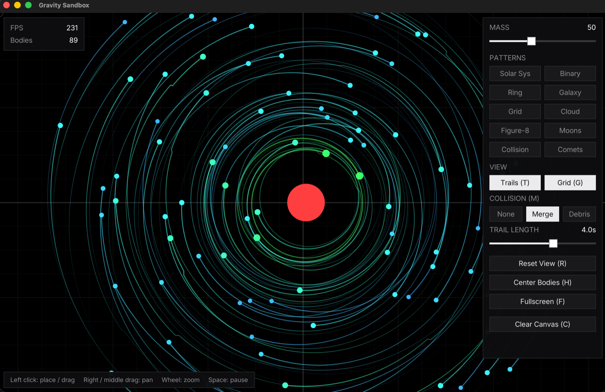

# Gravity Sandbox

An interactive Newtonian gravity simulator written in C++ with [raylib](https://github.com/raysan5/raylib).



Place dots of any mass on an infinite canvas and watch them attract, orbit, slingshot, and merge. Spawn preset systems — solar systems, binary stars, colliding galaxies, a stable three-body figure-eight — with a live preview at your cursor, and fly around the space with pan and zoom.

## Features

- **N-body physics** — softened Newtonian gravity, semi-implicit Euler integration with substepping, three collision modes (pass-through, momentum-conserving merge, or merge with debris ejection)
- **Placement** — click to drop a dot at the current mass (log-scale slider, 1–20,000); click an existing dot to drag it around
- **Patterns** — 10 presets placed with a mouse-follow ghost preview: Solar System, Binary Stars, Planet + Ring, Spiral Galaxy, Grid Collapse, Random Cloud, Figure-8, Moons, Collision, Comets
- **Camera** — infinite pan (right/middle drag), zoom to cursor (wheel), reset view, jump to barycenter of all bodies
- **Rendering** — motion trails with adjustable length, adaptive world grid, 4x MSAA, native-resolution (HiDPI) output, Inter font UI

## Controls

| Input | Action |
|---|---|
| Left click | Place a dot / drag an existing dot / stamp a pattern |
| Right or middle drag | Pan the camera |
| Mouse wheel | Zoom (centered on cursor) |
| `Space` | Pause / resume |
| `Up` / `Down` | Adjust placement mass |
| `T` | Toggle trails |
| `G` | Toggle grid |
| `M` | Cycle collision mode (none / merge / debris) |
| `R` | Reset view |
| `H` | Center camera on all bodies |
| `F` | Toggle fullscreen |
| `C` | Clear canvas |
| `Esc` | Cancel pattern placement |

Everything with a shortcut also has a button in the on-screen panel.

## Building

### Prerequisites

- CMake 3.15+
- A C++17 compiler (Clang, GCC, or MSVC)
- Git

raylib is vendored as a git submodule and built from source — no system-wide install needed.

### Quick start (macOS / Linux)

```sh
git clone https://github.com/siddharthroy12/gravitysandbox.git
cd gravitysandbox
./run.sh
```

`run.sh` initializes the raylib submodule if needed, configures CMake, builds, and launches. Options:

```sh
./run.sh --build   # compile only, don't launch
./run.sh --clean   # wipe the build directory and rebuild from scratch
```

### Manual build

```sh
git submodule update --init --depth 1 vendor/raylib
cmake -S . -B build -DCMAKE_BUILD_TYPE=Release
cmake --build build -j
./build/gravity_sandbox
```

On Linux you'll need raylib's X11/Wayland dependencies first (Debian/Ubuntu):

```sh
sudo apt install libasound2-dev libx11-dev libxrandr-dev libxi-dev \
    libgl1-mesa-dev libglu1-mesa-dev libxcursor-dev libxinerama-dev
```

## Project layout

```
├── src/
│   ├── main.cpp      # app loop, input, camera, world grid, HUD
│   ├── body.h        # Body struct, shared constants, mass/radius/color helpers
│   ├── physics.*     # N-body integration and collision resolution
│   ├── patterns.*    # preset pattern generators
│   └── ui.*          # theme, font loading, immediate-mode widgets
├── assets/           # Inter font (SIL OFL license), copied next to the binary at build
├── vendor/raylib/    # raylib submodule, built statically via CMake
├── CMakeLists.txt
└── run.sh            # build-and-run convenience script
```

## Physics notes

- Forces are computed brute-force over all pairs (O(n²)) with a softening term (`SOFTENING2`) that caps close-range forces and avoids singularities.
- Integration is semi-implicit (symplectic) Euler at 2 substeps per frame, which keeps orbits stable over long runs.
- When merging is enabled, bodies whose cores overlap combine into one, conserving mass and momentum; the merged color and radius follow the new mass.
- The Figure-8 pattern uses the Chenciner–Montgomery three-body choreography initial conditions, rescaled from normalized units to the simulation's G and pixel scale.

## License

Code: no license specified yet. The bundled Inter font is licensed under the [SIL Open Font License 1.1](assets/OFL.txt); raylib is [zlib/libpng](https://github.com/raysan5/raylib/blob/master/LICENSE).
